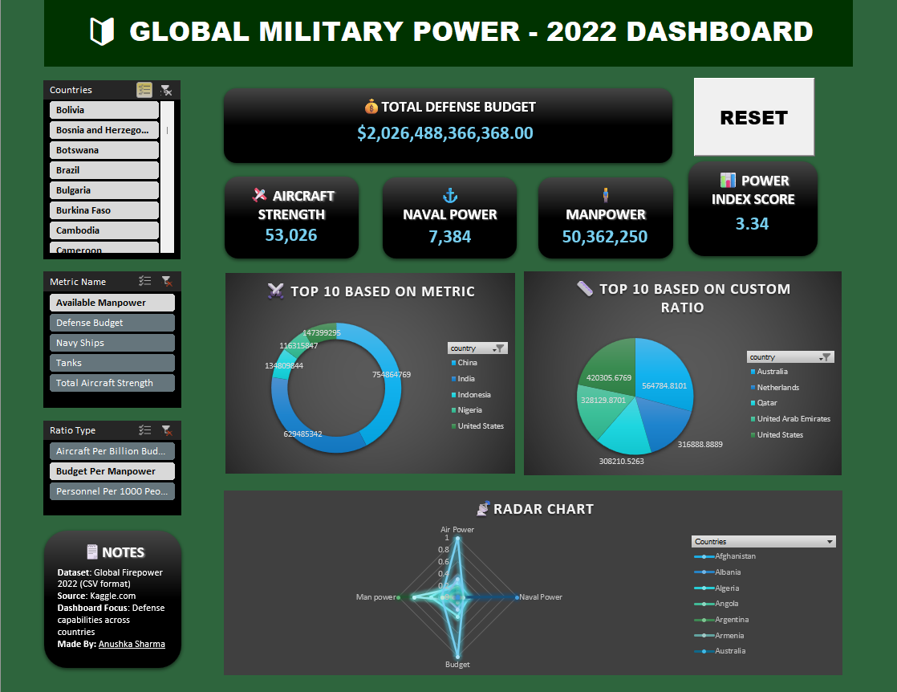

# 🛡️ Global Military Power Dashboard | Data Analytics

The **Global Military Power Dashboard - 2022** is an interactive Excel-based analytics tool that visualizes and compares the defense capabilities of countries worldwide using a wide range of military metrics. Designed to impress in portfolio reviews, this dashboard integrates KPIs, custom ratios, slicers, charts, and macros for a dynamic user experience.



---

## ✨ Features
- 🌍 Country-based slicer to filter data across visuals
- 📊 KPI Cards for Defense Budget, Aircraft Strength, Naval Power, Manpower, Power Index Score
- 📈 Top 10 bar & pie charts by selected metric and ratio
- 🧮 Custom ratio analysis (e.g., Budget per Manpower)
- 📉 Radar chart for multi-country capability comparison
- 🔄 RESET button using VBA macro to clear filters
- 📋 Notes section summarizing the dataset and credits

---

## 🛠️ Technologies & Tools Used

| Tool / Tech           | Purpose                                    |
|------------------------|--------------------------------------------|
| **Microsoft Excel**   | Dashboard development, slicers, PivotTables |
| **Power Query**       | Data cleaning and transformation            |
| **VBA (Macro)**       | Reset filters functionality                 |
| **Kaggle Dataset**    | Source of Global Firepower 2022 data        |
| **Formulas**          | KPI calculations and ratio logic            |
| **Conditional Formatting** | KPI and table visuals                  |

---

## ⚙️ How It Works
1. Load the dataset using Power Query for efficient data modeling.
2. Create PivotTables for KPIs and metrics (defense budget, manpower, etc.).
3. Build custom metrics like Aircraft per Billion Budget, Budget per Manpower using calculated fields.
4. Add interactivity through slicers and filter buttons.
5. Implement radar chart for visual comparison across power dimensions.
6. Use a VBA macro-enabled Reset button to clear all filters with one click.

---

## 🖼️ Preview  


---

## 📁 Repo Structure
```
📦 GlobalMilitaryPowerDashboard  
├── 📄 GlobalFirepowerDashboard.xlsm        # Final Excel dashboard (macro-enabled with slicers, charts, and reset button)  
├── 📄 GlobalFirepowerDashboard_original.xlsx  # Cleaned & structured version before VBA macros  
├── 📄 global firepower 2022.csv            # Raw dataset from Kaggle  
├── 📄 Dashboard_Preview.png                # Snapshot of the final dashboard  
└── 📄 README.md                            # Project documentation
```

---

## 📊 Dataset Structure

The dataset (`global firepower 2022.csv`) includes:
- Country Name
- Total Defense Budget
- Available Manpower
- Total Aircraft Strength
- Naval Assets (Ships)
- Tanks, Artillery, etc.
- Custom Power Index Score

Sourced from Kaggle’s [Global Firepower 2022 Dataset](https://www.kaggle.com/datasets/prasertk/military-power-by-country-2022)

---

## ✅ Use Cases
- Defense capability benchmarking across countries
- Exploratory data analysis for geopolitical insights
- Portfolio project to showcase Excel, Power Query, and VBA skills
- Ratio-based comparative analysis in military analytics

---

## 🧰 Setup Instructions
1. Download the repo or open `GlobalFirepowerDashboard.xlsm`
2. Enable macros for full functionality (Reset Button)
3. Use slicers on the left to filter by Country, Metric, or Ratio
4. Explore KPIs and visualizations interactively

---

## 📝 Notes
- 📌 **Built as a full-scale analytics portfolio project** to demonstrate advanced Excel capabilities in real-world military data analysis.
- 📊 **Integrates over 50+ countries' military data** covering manpower, naval power, air strength, and defense budgets.
- 🧠 **Highlights custom military ratios** like *Budget per Manpower*, *Aircraft per Billion Budget*, and more — enabling deep comparative analysis.
- 🛠️ **Includes slicer-driven interactivity**, PivotTables, radar visualizations, and a fully functional **VBA Reset Button** to reset filters in one click.
- 🧮 **Power Query and formula logic used extensively** for data transformation, KPI calculations, and dynamic visuals.
- 💼 Designed to reflect real-world analyst deliverables, and to help decision-makers quickly identify patterns in global defense distribution.
- ✅ 100% **Excel-native** — no external tools or plugins required.
- 🌐 **Dataset sourced from Kaggle’s Global Firepower 2022**, cleaned and modeled for optimal dashboard performance.
- 👩‍💻 Crafted with precision by **Anushka Sharma** to showcase end-to-end dashboarding and data storytelling skills.

---

## 🙋‍♀️ Author

**Anushka Sharma**  
🌐 [LinkedIn](https://www.linkedin.com/in/anushkasharma008/) • 🐱 [GitHub](https://github.com/Anushka-Sharma-008) 
🎓 Learning Data Science, Analytics & Machine Learning

---

## ⭐ Show Your Support

If you found this project helpful or inspiring:

- ⭐ Star this repository  
- 🛠️ Fork it to build upon or adapt it for your own use
- 💬 Share feedback or suggestions via Issues/Discussions
